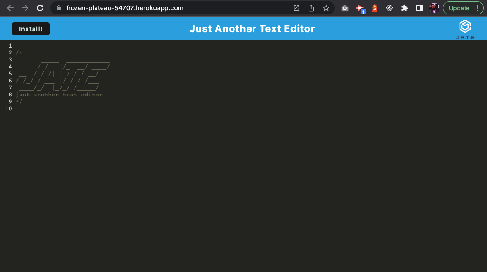
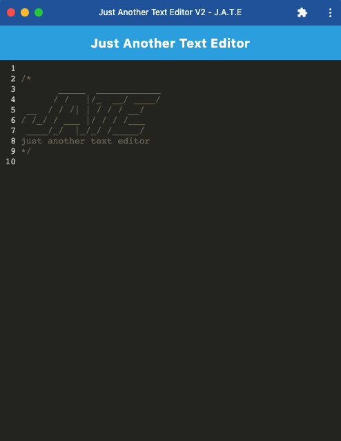
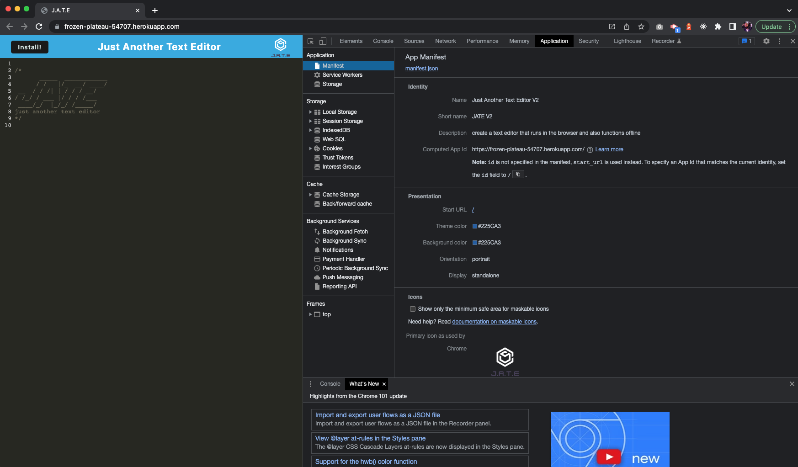
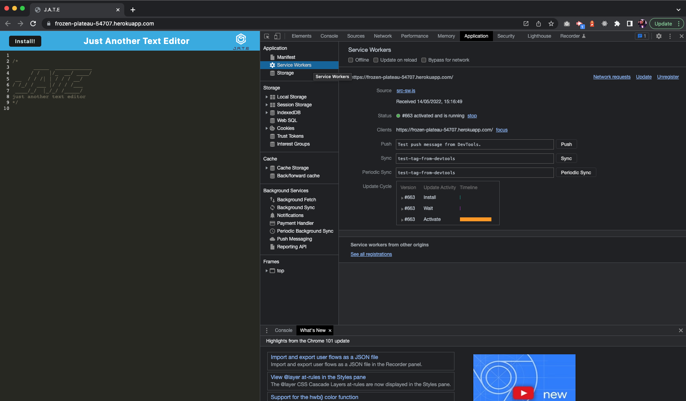
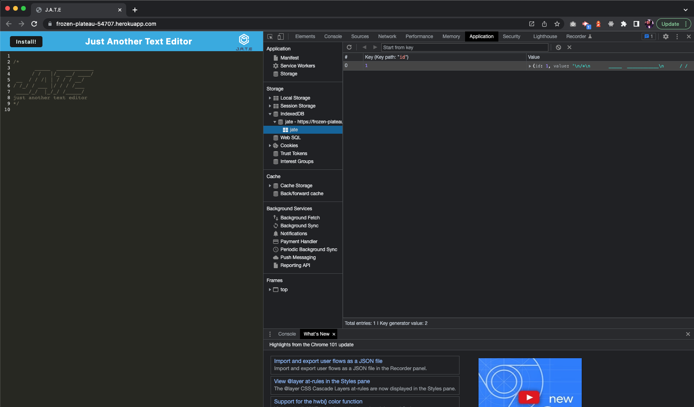

# Text-Editor

## Table of contents

- [Description](#description)
- [Installation](#installation)
- [Usage](#usage)
- [Technologies and Languages](#technologies-and-languages)
- [Contributing](#contributing)
- [Tests](#tests)
- [License](#license)
- [Screenshot](#screenshot)
- [Deployed application](#deployed-application)
- [GitHub repository](#github-repository)
- [Questions](#questions)

---

## Description

I have been tasked to build a text editor that runs in the browser. The app will be a single-page application that meets the PWA criteria. Additionally, it will feature a number of data persistence techniques that serve as redundancy in case one of the options is not supported by the browser. The application will also function offline.

---

## Installation

Start with cloning this repository link on to your local machine:

```
$ git clone https://github.com/riz1ash786/text-editor
$ cd text-editor
```

To install the required dependencies and set up the application, run:

```
$ npm i
$ npm run build
$ npm start
```

---

## Usage

This application can be deployed locally alternatively, if you wish to deploy this application on Heroku then please use the link provided in the 'Deployed Application' section listed below. The 'Install' button will allow the user to to download the web application as an icon onto their desktop.

---

## Technologies and Languages

<div>
&nbsp;
&nbsp;
&nbsp;
&nbsp;
&nbsp;
&nbsp;
&nbsp;
&nbsp;

</div>

---

[](https://github.com/riz1ash786/github-readme-stats)

## Contributing

<div id="badges">
  <a href="https://github.com/riz1ash786">
    
  </a>
</div>

---

## Tests

No tests have been specified for this application as of yet.

---

## License

 <br />
This application utilises the [ISC License](https://opensource.org/licenses/ISC "License Link")

---

## Screenshot











---

## Deployed Application

<div id="badges">
  <a href="https://frozen-plateau-54707.herokuapp.com/">
    
  </a>
</div>

---

## GitHub Repository

<div id="badges">
  <a href="https://github.com/riz1ash786/text-editor">
    
  </a>
</div>

---

## Questions

If you have any additional questions, then please feel free to get in touch via my github or email details linked below. Thank you.

<div id="badges">
  <a href="mailto:riz1ash786@gmail.com">
    
  </a>
</div>
